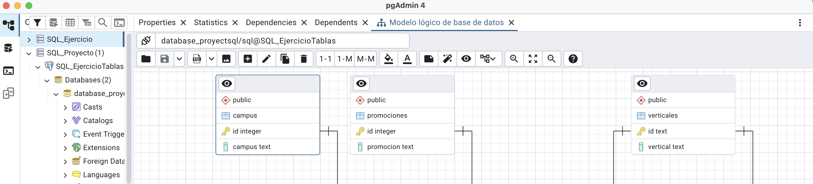
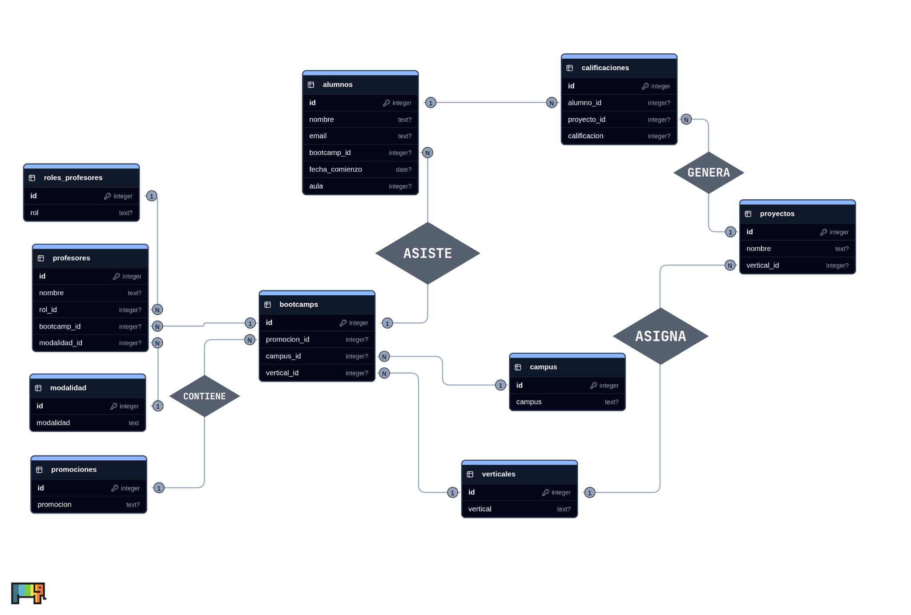

# Proyecto de Creación de Base de Datos Relacional

  

 

## Contributors

<!-- ALL-CONTRIBUTORS-LIST:START - Do not remove or modify this section -->
<!-- prettier-ignore-start -->
<!-- markdownlint-disable -->
<table>
  <tbody>
    <tr>
      <td align="center" valign="top" width="14.28%"><a href="https://github.com/rizzijp"> <b>rizzijp</b></a> <a href="#code-rizzijp" title="Code">💻</a></td>
    </tr>
  </tbody>
</table>

<!-- markdownlint-restore -->
<!-- prettier-ignore-end -->

<!-- ALL-CONTRIBUTORS-LIST:END -->

## 👤 Participantes

- Miguel Jiménez De La Torre
- Juan Pablo Rizzi
- Ángel Gómez Alonso
- Fabián González Martín
- Rebeca Díaz-Montenegro Sánchez

## 📖 Índice

- [Introducción](#-introducción)
- [Tareas que realizar](#-tareas-que-realizar)
- [Modelo Entidad-Relación (E/R)](#-modelo-entidad-relación-er)
- [Modelo Lógico de la Base de Datos](#-modelo-lógico-de-la-base-de-datos)
  - [1. Modalidad](#1-modalidad)
  - [2. Campus](#2-campus)
  - [3. Promociones](#3-promociones)
  - [4. Verticales](#4-verticales)
  - [5. Roles_profesores](#5-roles_profesores)
  - [6. Proyectos](#6-proyectos)
  - [7. Bootcamps](#7-bootcamps)
  - [8. Alumnos](#8-alumnos)
  - [9. Profesores](#9-profesores)
  - [10. Calificaciones](#10-calificaciones)

## 🖥️ Introducción
El proyecto consiste en diseñar e implementar una base de datos en PostgreSQL. Se creará un modelo E/R para definir entidades, atributos y relaciones, que luego se convertirá en un modelo lógico con tablas, claves primarias y foráneas. Se realizará la normalización de datos para evitar redundancias y garantizar integridad, y finalmente se creará la base de datos y se alojará en un servidor accesible desde aplicaciones externas.

## 📄 Tareas que realizar

1. **Modelo Entidad-Relación (E/R)**: Diseñar un modelo E/R que represente la estructura de la base de datos normalizada. Definir las entidades, atributos y relaciones entre ellas.
2. **Modelo Lógico de la Base de Datos**: Con base en el modelo E/R, desarrollar un modelo lógico de la base de datos. Esto implica definir la estructura de las tablas y sus campos, así como las claves primarias y foráneas necesarias.
3. **Normalización de Datos**: Analizar los datos y realizar una normalización adecuada para eliminar la redundancia y garantizar la integridad de los datos.
4. **Creación de la Base de Datos**: Utilizando un sistema de gestión de bases de datos de PostgreSQL, crear la base de datos y las tablas necesarias según el modelo lógico. Crear las queries necesarias para crear las tablas e ingestar los datos. Habrá que alojar en algún servidor vuestras bases de datos para poder acceder desde aplicaciones de terceros.
Algún servicio gratis de postgreSQL:

## 📑 Modelo Entidad-Relación (E/R)

## 📉 Modelo Lógico de la Base de Datos

%20(6).png)

### 1. Modalidad
*Tabla de modalidades de dictado (p. ej., presencial, online).*

| Columna | Tipo | Restricciones | Descripción |
| :--- | :--- | :--- | :--- |
| **id** | `INT` | `PK`, `NOT NULL` | Identificador único de la modalidad. |
| modalidad | `VARCHAR` | `NOT NULL` | Nombre de la modalidad. |

**Relaciones:**
* Modalidad (1) — (N) Profesores: cada profesor está asociado a una modalidad.

### 2. Campus
*Tabla de sedes.*

| Columna | Tipo | Restricciones | Descripción |
| :--- | :--- | :--- | :--- |
| **id** | `INT` | `PK`, `NOT NULL` | Identificador único del campus. |
| campus | `VARCHAR` | `NOT NULL` | Nombre de la sede (p. ej., Madrid, Valencia). |

**Relaciones:**
* Campus (1) — (N) Bootcamps: un campus puede albergar múltiples bootcamps.

### 3. Promociones
*Tabla de cohortes o ediciones.*

| Columna | Tipo | Restricciones | Descripción |
| :--- | :--- | :--- | :--- |
| **id** | `INT` | `PK`, `NOT NULL` | Identificador único de la promoción. |
| promocion | `VARCHAR` | `NOT NULL` | Nombre de la promoción/edición. |

**Relaciones:**
* Promociones (1) — (N) Bootcamps: una promoción agrupa varios bootcamps.

### 4. Verticales
*Tabla de áreas/verticales académicas (Data, Full Stack, Ciber, etc.).*

| Columna | Tipo | Restricciones | Descripción |
| :--- | :--- | :--- | :--- |
| **id** | `INT` | `PK`, `NOT NULL` | Identificador del vertical. |
| vertical | `VARCHAR` | `NOT NULL` | Nombre del vertical. |

**Relaciones:**
* Verticales (1) — (N) Bootcamps: un vertical puede tener muchos bootcamps.
* Verticales (1) — (N) Proyectos: cada proyecto pertenece a un vertical.

### 5. Roles_profesores
*Tabla de roles de docentes (Lead, TA, etc.).*

| Columna | Tipo | Restricciones | Descripción |
| :--- | :--- | :--- | :--- |
| **id** | `INT` | `PK`, `NOT NULL` | Identificador del rol. |
| rol | `VARCHAR` | `NOT NULL` | Nombre del rol. |

**Relaciones:**
* Roles_profesores (1) — (N) Profesores: cada profesor tiene un rol.

### 6. Proyectos
*Propósito: tabla de proyectos académicos que realizarán los alumnos.*

| Columna | Tipo | Restricciones | Descripción |
| :--- | :--- | :--- | :--- |
| **id** | `INT` | `PK`, `NOT NULL` | Identificador del proyecto. |
| nombre | `VARCHAR` | `NOT NULL` | Título del proyecto. |
| vertical_id | `INT` | `FK`, `NOT NULL` | Vertical al que pertenece (→ Verticales.id). |

**Relaciones:**
* Verticales (1) — (N) Proyectos.
* Proyectos (1) — (N) Calificaciones: un proyecto recibe múltiples calificaciones (una por alumno).

### 7. Bootcamps
*Propósito: instancia concreta de formación (vertical + campus + promoción).*

| Columna | Tipo | Restricciones | Descripción |
| :--- | :--- | :--- | :--- |
| **id** | `INT` | `PK`, `NOT NULL` | Identificador del bootcamp. |
| promocion_id | `INT` | `FK`, `NOT NULL` | Promoción/cohorte (→ Promociones.id). |
| campus_id | `INT` | `FK`, `NOT NULL` | Sede (→ Campus.id). |
| vertical_id | `INT` | `FK`, `NOT NULL` | Vertical académico (→ Verticales.id). |

**Relaciones:**
* Promociones (1) — (N) Bootcamps.
* Campus (1) — (N) Bootcamps.
* Verticales (1) — (N) Bootcamps.
* Bootcamps (1) — (N) Alumnos: un bootcamp tiene muchos alumnos.
* Bootcamps (1) — (N) Profesores: un bootcamp tiene muchos profesores.

### 8. Alumnos
*Tabla de registro de estudiantes.*

| Columna | Tipo | Restricciones | Descripción |
| :--- | :--- | :--- | :--- |
| **id** | `INT` | `PK`, `NOT NULL` | Identificador del alumno. |
| nombre | `VARCHAR` | `NOT NULL` | Nombre completo. |
| email | `VARCHAR` | `NOT NULL` | Correo del alumno (idealmente único). |
| bootcamp_id | `INT` | `FK`, `NOT NULL` | Bootcamp al que asiste (→ Bootcamps.id). |
| fecha_comienzo | `DATE` | | Fecha de inicio del alumno. |
| aula | `INT` | | Número de aula/grupo (si aplica). |

**Relaciones:**
* Bootcamps (1) — (N) Alumnos.
* Alumnos (1) — (N) Calificaciones: un alumno puede tener varias calificaciones (una por proyecto).

### 9. Profesores
*Tabla de registro de docentes y su asignación.*

| Columna | Tipo | Restricciones | Descripción |
| :--- | :--- | :--- | :--- |
| **id** | `INT` | `PK`, `NOT NULL` | Identificador del profesor. |
| nombre | `VARCHAR` | `NOT NULL` | Nombre completo. |
| rol_id | `INT` | `FK`, `NOT NULL` | Rol del docente (→ Roles_profesores.id). |
| bootcamp_id | `INT` | `FK`, `NOT NULL` | Bootcamp asignado (→ Bootcamps.id). |
| modalidad_id | `INT` | `FK`, `NOT NULL` | Modalidad en la que dicta (→ Modalidad.id). |

**Relaciones:**
* Bootcamps (1) — (N) Profesores.
* Roles_profesores (1) — (N) Profesores.
* Modalidad (1) — (N) Profesores.

### 10. Calificaciones
*Tabla de evaluaciones (nota) que vinculan alumno–proyecto.*

| Columna | Tipo | Restricciones | Descripción |
| :--- | :--- | :--- | :--- |
| **id** | `INT` | `PK`, `NOT NULL` | Identificador de la calificación. |
| alumno_id | `INT` | `FK`, `NOT NULL` | Alumno evaluado (→ Alumnos.id). |
| proyecto_id | `INT` | `FK`, `NOT NULL` | Proyecto evaluado (→ Proyectos.id). |
| calificacion | `VARCHAR` | `NOT NULL` | Nota (Apto/ No Apto). |

**Relaciones:**
* Alumnos (1) — (N) Calificaciones.
* Proyectos (1) — (N) Calificaciones.
